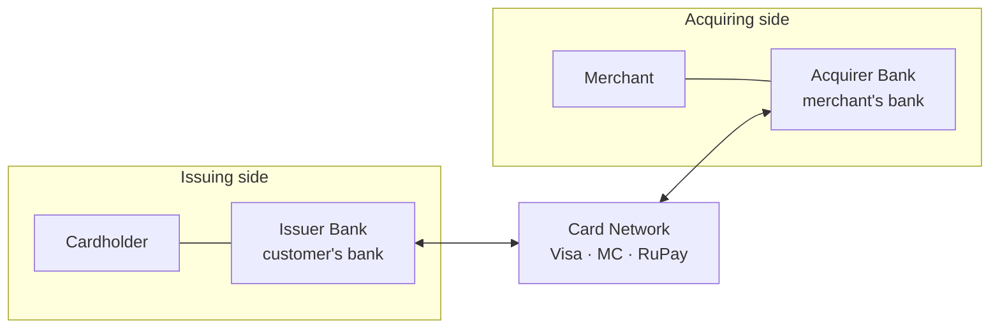
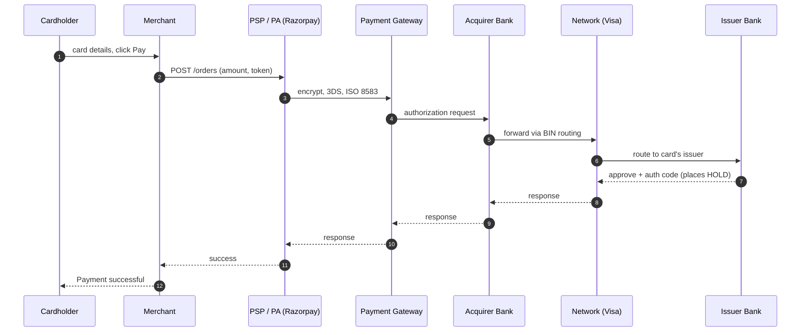
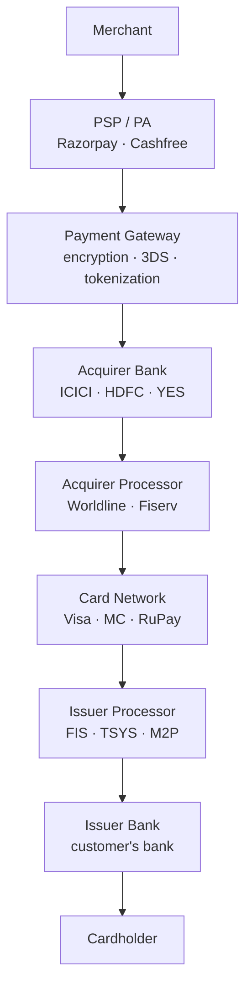
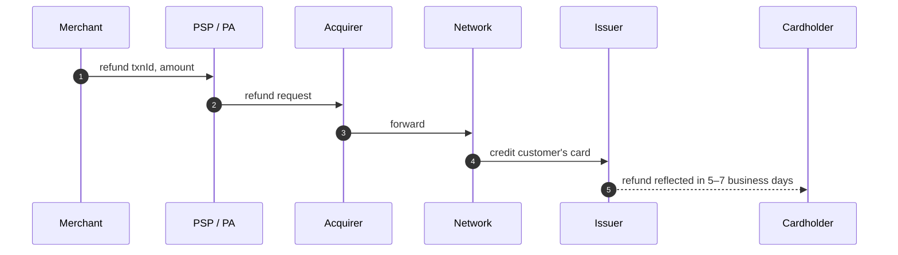
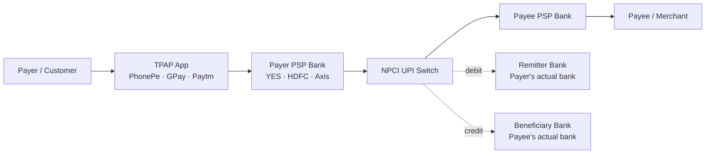
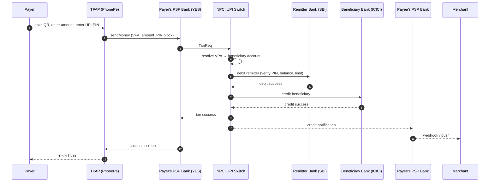
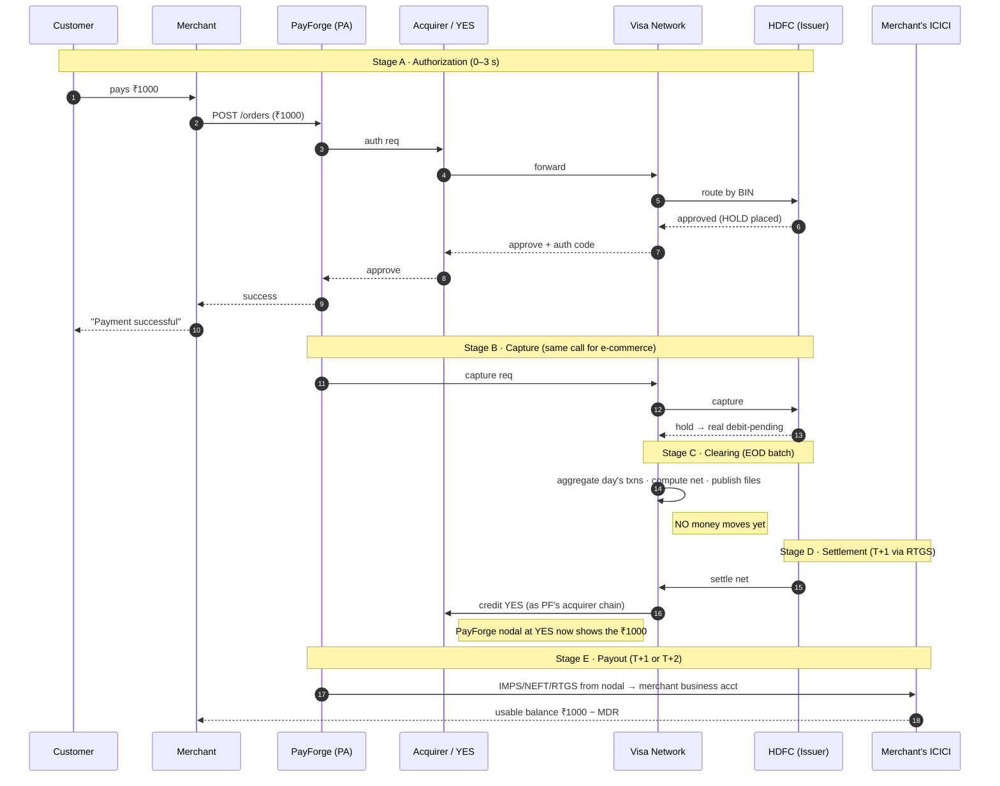

# actors.md — Payment Ecosystem Actors & Money Movement

> Phase -1 · Day 1 deliverable. Written by @Vaibhaw42 with Q&A guidance.
> Focus: India-first (UPI + cards + RBI). Global patterns second.

---

## 1 · Glossary

- **Issuer** — the bank that issued the customer's card (credit or debit). Holds the customer's funds (debit) or extends credit (credit card). Bears fraud/credit risk. Earns **interchange** on every transaction — biggest single slice of the MDR pie.
- **Acquirer** — the bank with an acquiring relationship to the merchant (directly, or via a PA like Razorpay). Receives settled funds from the card network on the merchant's behalf. Earns a slice of MDR. Bears chargeback + merchant risk. In India: HDFC, ICICI, Axis, SBI are large acquirers.
- **Card Network (Visa / Mastercard / RuPay / Amex)** — the messaging switch + rulebook that routes transactions between issuers and acquirers and guarantees settlement between member banks. Publishes operating rules for chargebacks, disputes, and liability shifts. Earns a **scheme / assessment fee** (~0.10–0.15%) per transaction. **RuPay** is India's domestic scheme, operated by **NPCI**.
- **Payment Gateway (PG)** — pure tech middleware that encrypts, tokenizes, and routes card/UPI transactions between the merchant's checkout and the network/PA. **Cannot legally hold merchant funds** — that requires a PA license (RBI, 2020). Handles PCI-scope work: 3D Secure challenge, tokenization, hosted checkout. Revenue = per-txn processing fee.
- **Payment Aggregator (PA)** — a licensed non-bank entity that pools payment flows from many merchants under a single acquiring relationship, so small merchants can accept cards without signing directly with a bank. Merchant funds sit in the PA's **nodal / escrow account** at its **sponsor bank** for up to T+1 (or per contract) before payout. Requires an RBI PA license (mandated by RBI's March 2020 PA/PG guidelines). Revenue = markup on MDR (charges merchant more than its acquiring cost, keeps the spread). Examples: Razorpay, Cashfree, PayU, CCAvenue.
- **PSP (Payment Service Provider)** — umbrella term for any company providing payment services to merchants (may be a PG, a PA, or both). Stripe, Adyen, Razorpay are all PSPs. In the **UPI context** specifically, "PSP Bank" is a scheduled commercial bank licensed by **NPCI** to run the UPI-PSP interface on behalf of a **TPAP** app — YES Bank for PhonePe, HDFC/Axis for GPay, Paytm Payments Bank (historically) for Paytm. A TPAP app cannot talk to NPCI directly; must route through its PSP Bank.
- **Processor** — a backend tech vendor that runs the actual switching, authorization, and settlement software *on behalf of* the issuing or acquiring bank. Not a hop in the merchant's visible flow — an invisible layer inside the bank. **Issuer processors** (FIS, TSYS, Fiserv, M2P, Zeta) run card management + auth for issuers. **Acquirer processors** (Worldline, Fiserv, First Data) run POS + settlement for acquirers. Banks pay per-transaction.
- **Nodal / Escrow account** — a segregated bank account at a scheduled commercial bank (the PA's sponsor bank) where a PA holds merchant funds **in trust** before payout. Legally ringfenced: the PA cannot commingle these funds with its own operating cash, use them as working capital, or earn interest on them. If the PA becomes insolvent, merchant funds are protected. RBI mandates strict reconciliation and audit. Pre-2020 term was "nodal"; RBI's 2020 PA guidelines switched to "escrow" to emphasize the trust nature — both terms used interchangeably today.
- **Sponsor bank** — a scheduled commercial bank that hosts a PA's nodal/escrow account and acts as the regulatory + operational bridge between the non-bank PA and the payment rails (networks, NPCI, RBI). Every PA must have one; a non-bank cannot connect directly to rails. Bears compliance responsibility for the PA's activity on its account. **Concentration risk:** if the sponsor bank hits trouble, PA operations stall — the YES Bank moratorium (March 2020) froze PA/TPAP flows briefly. Large PAs mitigate by diversifying across multiple sponsors. In UPI, the equivalent is the **PSP Bank** for a TPAP.
- **MDR (Merchant Discount Rate)** — the percentage fee a merchant pays on every card transaction to accept payment. Deducted from the transaction amount before payout, so the merchant receives `amount − MDR`. Split across **interchange** (issuer, biggest slice), **scheme/assessment fee** (network), **acquirer margin**, **PA/PSP markup**, plus **18% GST** on the fees. India card MDR ranges roughly 1.5–2.5% (RBI caps by card type; AMEX/Diners up to 3.5%). **UPI P2M MDR is 0%** (government mandate, Jan 2020); PSPs subsidize UPI via card MDR and adjacent revenue like BBPS, cross-sell, and ads. RuPay debit is also 0% MDR for small transactions.
- **TPAP (Third Party App Provider)** — a company approved by NPCI to build user-facing UPI apps. Provides the app UI, notifications, QR scanning, VPA registration. **Cannot hold funds. Cannot connect to NPCI directly** — must route through one or more **PSP Banks**. Examples: PhonePe, GPay, Paytm, CRED, Amazon Pay. Regulated under NPCI's UPI Procedural Guidelines.
- **VPA (Virtual Payment Address)** — a user-facing UPI identifier in the format `handle@psp-bank-code` (e.g. `vaibhaw@ybl`, `alice@okhdfcbank`, `bob@paytm`). The suffix identifies the **PSP Bank** that routes NPCI requests, **not the user's actual account bank**. Multiple VPAs can point to the same underlying bank account. Purpose: expose only a routing identifier while keeping the account number private. Common codes: `@ybl` (YES via PhonePe), `@okhdfcbank`/`@okaxis`/`@okicici` (via GPay), `@paytm` (Paytm), `@axl` (CRED via Axis).
- **NPCI (National Payments Corporation of India)** — a not-for-profit **operator** (not a regulator) promoted by RBI and the Indian Banks' Association. Operates India's retail payment systems: **UPI, IMPS, NACH, AePS, BHIM, RuPay, BBPS (Bharat BillPay), NETC (FASTag), CTS (cheque truncation)**. Publishes UPI procedural guidelines and approves TPAPs and PSP Banks. Owned by member banks.
- **RBI (Reserve Bank of India)** — India's central bank and financial regulator. Sets monetary policy, issues currency, licenses banks and non-bank entities (Payment Aggregators, NBFCs, PPIs, Payments Banks). Publishes rulebooks including the PA/PG Guidelines (2020), UPI-related regulations, and the data localization mandate (2018 — all Indian payment data must be stored on Indian soil). Regulator of NPCI. Does **not** operate payment systems itself.
- **Interchange** — the fee paid **by the acquirer to the issuer** on every card transaction. Set by the card network (Visa/MC/RuPay) via its interchange table. Compensates the issuer for extending credit, bearing fraud risk, and covering card-issuance cost — and incentivizes banks to issue more cards. **Biggest single slice of MDR** (~1–1.2% of a ~2% MDR). Regulated in some markets: EU capped at 0.2% (debit) / 0.3% (credit); India's RBI caps debit interchange by merchant category.
- **Assessment / Scheme fee** — the fee paid by the **acquirer to the card network** (Visa/MC/RuPay/Amex) on every transaction. Rate ≈ 0.10–0.15% of transaction value; sometimes split into a percentage-based **assessment fee** plus a flat per-transaction **authorization fee**. Compensates the network for running the switching infrastructure, licensing the brand, providing fraud tooling, and maintaining the rulebook. Second-largest slice of MDR after interchange.
- **Authorization (auth)** — the issuer's real-time approve-or-decline decision on a transaction request. Sent via the network from acquirer/PSP to issuer, who checks card validity, funds/credit availability, and fraud rules. On approval, the issuer places a **hold** on the customer's balance — available balance goes down, but the account is not actually debited yet. Holds auto-expire in 5–7 days if not captured.
- **Capture** — the merchant's explicit request to convert a previous authorization's hold into a real debit on the customer's account. Sent via the network to the issuer. Auth + capture in a single call is called a **"sale"** (default for most e-commerce). Delayed capture is used when the final amount isn't known at auth time — hotels (auth at check-in, capture at check-out), ride-hailing (auth ₹100 hold, capture actual fare), or ship-on-order flows. If capture doesn't happen within the auth's TTL, the hold expires and money returns to the customer.
- **Clearing** — the batch process (typically end-of-day) where the card network aggregates all captured transactions and calculates the **net amount owed between each pair of member banks**. Produces settlement instructions. **No money moves during clearing** — it is purely accounting and instruction generation.
- **Settlement** — the actual bank-to-bank movement of money based on clearing instructions. Executed via RTGS (or equivalent bank-to-bank rail) on **T+1** — one business day after the transaction. Money flows: issuer bank → network settlement account → acquirer bank → (via PA nodal, if applicable) → merchant's bank. **Settlement ≠ payout** — settlement is between banks; the PA-to-merchant payout is a separate later step.

---

## 2 · Cards ecosystem

### 2.1 · The four-corner model

Card payments are built on a **four-corner** architecture — four principal parties, everything else is glue.



- **Cardholder ↔ Issuer** — issuer gave the card; customer settles their bill with them.
- **Merchant ↔ Acquirer** — acquirer signed the merchant up to accept cards; pays out sales.
- **Issuer ↔ Acquirer** — they do not know each other's customers. The **network** is the switch that lets them talk.

### 2.2 · Two flows on the same rails — messages vs money

The single most important distinction in the whole domain.

**Message flow (real-time, sub-second to a few seconds):**



**Money flow (batch, T+1):**

```
Issuer bank
   └─► Network's settlement account
          └─► Acquirer bank
                 └─► PA nodal / escrow (Razorpay)
                        └─► Merchant's business bank
```

- Executes via RTGS / inter-bank rail on **T+1**.
- Merchant only sees funds after PA's payout step — usually T+1 or T+2 after txn date.
- **Bugs in fintech systems live at the boundary between message flow and money flow.**

### 2.3 · Where PSP/PA/PG sit — acquiring-side zoom

PA sits on the **acquiring side**, between merchant and acquirer bank.



**What PA hides from the merchant:**

1. Direct **acquirer contract** — PA holds it; merchant plugs into PA.
2. **Which network is used** (Visa vs MC vs RuPay — smart routing).
3. **Which processor** does the switching.
4. **PCI DSS scope** — PA holds PCI scope; merchant is out of scope. Huge cost saving.
5. **Network certifications** — Visa/MC/RuPay each require cert; PA does it once, all merchants inherit.
6. **Chargeback handling + reconciliation + settlement files + ISO 8583 wire format** — all PA problem.

Merchant's mental model: *"I pay Razorpay to accept payments."* Everything else is Razorpay's problem.

### 2.4 · Card network's role — routing vs clearing

Two hats depending on the flow:

| Flow | Network does |
|------|--------------|
| **Message (real-time)** | Pure switch. BIN-based routing to issuer. Enforces ISO 8583 protocol. Adds advisory fraud scoring (Visa Advanced Auth, MC SAFE). **Does NOT approve or deny** — that's the issuer's decision; network only relays it. |
| **Money (T+1 batch)** | **Clearing** — aggregates all captured transactions end-of-day, computes the net amount owed between every pair of member banks. Publishes settlement instructions. Runs a **settlement bank** through which inter-bank money movement is coordinated. |

Without the network, ICICI's POS could never reach HDFC's card, and banks would have no shared source of truth on who owes whom.

### 2.5 · Refund / reverse flow

A refund is a **new transaction** on the same rails, in the opposite direction.



- Refund has its own auth flow (issuer approves the credit-back).
- Money returns via same T+1 rails, reversed direction.
- **Original MDR usually not refunded to merchant** — merchant eats the fee.
- Customer sees refund on statement in **5–7 business days** due to issuer processing.

### 2.6 · ISO 8583 — the wire format

All card message flow globally speaks **ISO 8583**, a fixed protocol with 128 numbered fields (PAN, amount, MCC, timestamp, etc.). Standardized in 1987 and still ubiquitous. Every issuer, network, and processor speaks it under the hood. Modern APIs (Stripe, Razorpay) wrap ISO 8583 in JSON so an application developer never sees it — but it is the low-level truth of the card wire.


---

## 3 · UPI ecosystem

### 3.1 · How UPI differs structurally from cards

UPI is India's real-time bank-to-bank rail, operated by NPCI (launched April 2016). It replaces card networks + interchange + T+1 settlement with a **government-run switch that speaks directly to member banks**. Simpler, cheaper, faster.

| Aspect | Cards | UPI |
|--------|-------|-----|
| Rail | Visa/MC/RuPay | NPCI UPI switch (on top of IMPS) |
| Identifier | 16-digit PAN | **VPA** (`user@psp-bank-code`) |
| Direction | Pull (merchant charges) | **Push OR pull** |
| Money latency | T+1 batch | **~seconds, real-time settle** |
| P2M MDR | 1.5–2.5% | **0%** (govt mandate, Jan 2020) |
| Credit line | Native | RuPay CC on UPI only (has MDR) |
| Global | Yes | India-only (expanding to UAE, SG, FR, LK, NP, BT) |
| KYC binding | Card → issuer | VPA → bank account |

### 3.2 · Actors



- **Payer / Payee** — end users (P2P or P2M).
- **TPAP** — user-facing app (PhonePe, GPay, Paytm, CRED, Amazon Pay). Non-bank. Cannot connect to NPCI directly.
- **PSP Bank** — a scheduled commercial bank running the UPI-PSP interface *for* a TPAP. Every TPAP contracts with 1+ PSP Banks. NPCI recognizes only banks as endpoints. Common handles: `@ybl` (YES via PhonePe), `@okhdfcbank`/`@okaxis` (via GPay), `@paytm` (Paytm), `@axl` (Axis via CRED).
- **NPCI UPI Switch** — central operator. Runs VPA registry, mandate registry (AutoPay), routing, reconciliation.
- **Remitter Bank** — payer's actual bank. May or may not equal payer's PSP Bank.
- **Beneficiary Bank** — payee's actual bank.

**Crucial insight:** the TPAP app, the PSP Bank, and the remitter bank are often **three different entities**. UPI decouples them — a user's SBI money can flow via PhonePe (TPAP) using YES Bank (PSP) as the interface into NPCI.

### 3.3 · Two request patterns

- **UPI Push** (scan QR, pay to VPA) — payer initiates. >90% of P2M today.
- **UPI Collect** (request-to-pay) — payee initiates a collect request. Fell out of favor after fake-collect fraud waves.

### 3.4 · Message flow — UPI push txn



Full cycle 2–5 seconds. Money moves between banks **in real time** — no T+1 batch.

### 3.5 · VPA resolution

For `merchant@ybl`:

1. Payer's PSP Bank forwards request to NPCI.
2. NPCI's **VPA registry** maps `merchant@ybl` → PSP Bank YES → underlying account (e.g. ICICI acct #12345).
3. NPCI routes the credit-request to ICICI (beneficiary bank).

A **VPA is a bank-account routing token**. It hides the account number from the payer, and the underlying bank can be swapped in TPAP settings without the VPA changing.

### 3.6 · Static QR vs dynamic QR — the reconciliation split

| Type | Contents | Use case |
|------|----------|----------|
| **Static QR** | `pa=merchant@ybl&pn=Name` (VPA + name) | Kirana counter. Payer enters amount. Human-eye reconciliation. |
| **Dynamic QR** | `pa=merchant@ybl&pn=Name&am=500&tr=ORDER-8842&tn=...` | E-commerce / any scale. Order ID auto-echoed back → automatic reconciliation. |

**Static QR reconciliation problem:** incoming txn has only VPA + name + amount + UTR. Two customers paying same amount at same second → collision. Fine for a shopkeeper who sees the customer standing there; broken at scale.

**Solutions at scale:**

- **Dynamic QR with `tr` (transaction reference)** — echoes back your order id.
- **VPA per order** — large PAs mint thousands of VPAs per second, one per order.
- **UPI Intent link** — mobile deep-link with `tr` + `am` pre-filled: `upi://pay?pa=...&am=...&tr=...`.

**Design lesson for PayForge:** every UPI acceptance generates a per-order dynamic QR / Intent link with your order id in `tr`. Reconciliation is a first-class feature, not an afterthought.

### 3.7 · Special UPI variants (to be aware of)

- **UPI Lite** — small offline txns (≤ ₹200), no PIN, wallet-like top-up. Fast for low-value flows.
- **UPI AutoPay (e-Mandate)** — recurring debits (Netflix, EMI). One-time mandate approval → auto-debit thereafter.
- **UPI 123Pay** — UPI for feature phones via IVR / missed-call.
- **RuPay Credit Card on UPI** — credit line accessed via UPI. **This DOES carry MDR** (uses card rails underneath). Big new revenue stream for PSPs since 2022.
- **UPI Circle** — delegated payments (parent → child limited-access VPA).
- **Credit Line on UPI** — pre-sanctioned bank credit line accessed via UPI (2023+).
- **UPI International** — inbound/outbound corridors: UAE, Singapore, France, Sri Lanka, Nepal, Bhutan, Mauritius.

### 3.8 · UPI reversal / refund

- **Auto-reversal (NPCI decision)** — if debit succeeded but credit failed mid-transaction, NPCI auto-reverses. Payer sees the debit undone within minutes.
- **Merchant-initiated refund** — merchant sends refund via PSP Bank → NPCI → payer's bank credit. **Real-time.** Payer sees refund in seconds to minutes (vs 5–7 business days for cards).

### 3.9 · How UPI PSPs make money despite 0% MDR

UPI P2M MDR = 0% (govt mandate). PSPs (PhonePe, GPay, Paytm) run UPI at a **loss per txn**, subsidize via layered revenue:

1. **RuPay Credit Card on UPI MDR** — biggest new stream since 2022.
2. **BBPS (Bharat BillPay) commissions** — bill payments (electricity, gas, DTH, mobile, insurance) earn commission per txn.
3. **Cross-sell financial products** — insurance, mutual funds, digital gold, personal loans, credit-card sourcing. PhonePe distributes → earns commissions from insurers, AMCs, lenders.
4. **Merchant services** — soundbox rentals (~₹99–125/mo/device across huge fleets), POS terminals, merchant subscriptions, business analytics.
5. **Ads / super-app placements** — sponsored offers, home-screen tiles.
6. **Investment platforms** — PhonePe stocks, PhonePe Wealth, etc.
7. **Small govt incentive** — RuPay debit + BHIM-UPI subsidy (~₹0.15/txn) via banks, share to TPAPs.

**Mental model:** UPI = customer acquisition cost. Monetize via financial products stacked on top.


---

## 4 · Money-flow trace — ₹1000 card txn end-to-end

**Scenario:** Customer buys ₹1000 book on a PayForge-integrated merchant. Customer's card = HDFC debit (Visa). Merchant uses PayForge (acting as PA) with **YES Bank** as sponsor, and merchant's business account is with **ICICI**.

### 4.1 · Timeline

| Stage | When | What happens | Money moved? |
|-------|------|--------------|--------------|
| **A · Authorization** | t = 0s → 3s | Merchant → PayForge → PG → Acquirer → Visa → HDFC. HDFC places ₹1000 **hold** on customer's account. Returns auth code. | No — hold only |
| **B · Capture** | t = 0s → 5s (auth+capture in one call for e-commerce = "sale") | Merchant confirms. Hold converted into a real debit request. | Committed but not yet moved between banks |
| **C · Clearing** | End of business day (T, ~23:00) | Visa aggregates all txns of the day, computes net owed between HDFC (issuer) and PayForge's acquirer chain (Visa → YES via sponsor). Publishes settlement instructions. | No — accounting only |
| **D · Settlement** | T+1 morning (via RTGS) | HDFC debits customer's account. Money flows: HDFC → Visa's settlement bank → YES Bank (as acquirer-side sponsor for PayForge's nodal). | Yes — between banks |
| **E · Payout** | T+1 or T+2 (per merchant contract) | PayForge debits its nodal (at YES), credits merchant's business account at ICICI via IMPS/NEFT/RTGS. Merchant finally has spendable money. | Yes — nodal → merchant |

### 4.2 · Sequence diagram (all five stages)



### 4.3 · Key insights

- Customer sees "Payment Successful" **before any money has actually moved between banks**. The auth is a promise.
- The bug surface between stage B (commit) and stage D (settle) is where reconciliation systems live. This is Phase 5 (Ledger) and Phase 6 (Settlement) of PayForge.
- Merchant's usable money lags the customer's checkout by **~24–48 hours**. The float in between sits in PayForge's nodal — legally not PayForge's money.

---

## 5 · Fee breakdown

For a ₹1000 credit-card txn (typical Indian rates; regulated caps apply per card type). All fees are approximate — actual rates depend on network, card type (credit/debit/prepaid), merchant category, and PA contract.

| Line item | Actor receiving | Rate | Amount |
|-----------|-----------------|------|--------|
| Interchange | Issuer (HDFC) | ~1.10% | **₹11.00** |
| Scheme / assessment fee | Card network (Visa) | ~0.13% | **₹1.30** |
| Acquirer margin | Acquiring bank (YES via chain) | ~0.20% | **₹2.00** |
| PA / PSP markup | PayForge | ~0.55% | **₹5.50** |
| GST 18% on fees | Government | 18% × ₹19.80 | **₹3.56** |
| **Total MDR** |  | ~2.34% | **~₹23.36** |
| **Merchant receives** |  |  | **~₹976.64** |

**Notes:**

- Debit-card MDR is much lower (RBI-capped, ~0.4–0.9% by category).
- AMEX / Diners typically 3–3.5% (no interchange model, direct network-issuer).
- International cards attract additional cross-border assessment (~1%).
- **UPI P2M MDR = 0%** — merchant receives full ₹1000. All actors work on that flow at a loss, subsidized elsewhere (see §3.9).
- **RuPay debit ≤ ₹2000 = 0% MDR** (govt push).
- **RuPay Credit Card on UPI = has MDR** (~2%, uses card rails underneath).

---

## 6 · India-specific notes (RBI, NPCI, PA/PG, UPI)

### 6.1 · RBI PA/PG Guidelines, March 2020

The single most important regulation to understand for PayForge.

- Created two RBI-recognized categories:
  - **PA (Payment Aggregator)** — can **hold merchant funds** in escrow. Requires RBI PA license. Minimum net worth ₹15 crore initially, ₹25 crore ongoing.
  - **PG (Payment Gateway)** — pure tech provider, **cannot hold funds**. No license required to be a PG, but if you touch money you must be a PA.
- Escrow account rules — no commingling, no interest to PA, strict reconciliation.
- Merchant onboarding KYC responsibility falls on the PA.
- Data storage — must be in India (see 6.4).

### 6.2 · Sponsor bank requirement

Non-bank PAs cannot directly connect to networks or NPCI. Every PA has a **sponsor bank** (scheduled commercial bank) that:

- Hosts the PA's nodal/escrow account.
- Vouches for the PA to networks / RBI.
- Bears compliance responsibility for activity on the account.

Concentration risk: YES Bank moratorium (Mar 2020) briefly froze Razorpay / PhonePe operations. Large PAs today diversify across multiple sponsor banks (Razorpay uses ICICI + others).

### 6.3 · UPI government mandates

- **Zero MDR for UPI P2M** — Ministry of Finance, effective Jan 2020. PSPs run UPI at a loss on the flow.
- **Zero MDR for RuPay debit ≤ ₹2000** — same mandate.
- **UPI market-share cap** — NPCI plans to enforce a 30% cap per TPAP by Dec 2026 (originally Dec 2024, deferred). PhonePe (~47%) and GPay (~35%) are above cap; forced redistribution ahead.
- **UPI International** — RBI-driven push (UAE, SG, FR, LK, NP, BT, MU).

### 6.4 · Data localization (RBI, April 2018)

All **payment system data** must be stored **only in India**. Applies to card networks, PAs, PGs, wallets, TPAPs, PSP Banks. Copies may be made abroad *after* being stored in India (for global-processor use cases like Visa's fraud engine).

**Consequence for PayForge:** DB must be Indian region (ap-south-1 or on-prem India). Backup replication must be Indian. Vendor selection (cloud, monitoring, logging) constrained.

### 6.5 · KYC / AML

- **Merchant KYC** — PA is responsible. Uses DigiLocker, PAN, GST, bank penny-drop verification, video KYC.
- **Customer KYC** — done by the issuing bank (for cards) or the PSP Bank (for UPI VPA registration). PA/merchant re-uses this.
- **AML / STR / SAR** — RBI's FIU-IND requires Suspicious Transaction Reports for flagged patterns.
- **PMLA** — Prevention of Money Laundering Act applies to PAs; must retain records 5+ years.

### 6.6 · NPCI's operational surface

NPCI is not just UPI. Also runs:

| System | Purpose |
|--------|---------|
| **UPI** | Real-time bank-to-bank |
| **IMPS** | Real-time inter-bank (underlying UPI) |
| **NACH** | Bulk debits (SIPs, salaries, EMI) |
| **AePS** | Aadhaar-based banking at BC agents |
| **RuPay** | India's card network |
| **BHIM** | NPCI's reference UPI app |
| **BBPS (Bharat BillPay)** | Standardized bill payments |
| **NETC (FASTag)** | Toll collection |
| **CTS** | Cheque truncation |

For PayForge you'll integrate directly with **UPI**, indirectly touch **RuPay**, and possibly consume **BBPS** later.


---

## 5 · Fee breakdown

_(pending)_

---

## 6 · India-specific notes (RBI, NPCI, PA/PG, UPI)

_(pending)_

---

## 7 · What I still don't understand

Honest gaps as of end of Day 1. To be closed by re-reading, Day 2+ material, and coach re-quizzes.

### 7.1 · Terminology still mingles

**PA, PG, PSP, Processor, Network** — these four still blur together for me. The distinctions I keep having to re-look up:

- **PA vs PG** — both are "the thing merchants integrate with", but PA has a license to hold money in escrow and PG does not. Most Indian aggregators (Razorpay) are actually **both** — that's why they blur.
- **PSP** — umbrella word. In global usage = any payment company. In UPI = "PSP Bank" = a licensed bank running the UPI-PSP interface for a TPAP. Same acronym, two very different meanings.
- **Processor** — invisible tech vendor inside a bank (issuer or acquirer). I keep wanting to place it in the merchant's flow, but the merchant never sees it directly.
- **Network** — Visa/MC/RuPay. Switch in messages, clearer in money. It never approves or denies — the issuer does.

**Quick disambiguation table for future me:**

| Term | Side | Legal to hold money? | Merchant-facing? | Example |
|------|------|----------------------|------------------|---------|
| Issuer | Issuing | Yes (customer's bank) | No | HDFC (cardholder's bank) |
| Acquirer | Acquiring | Yes (merchant's bank) | No (via PA) | ICICI, YES |
| Network | Middle | No | No | Visa, MC, RuPay |
| Processor | Inside a bank | No | No — invisible | FIS, M2P, Worldline |
| PA | Acquiring | **Yes, in escrow** | **Yes** | Razorpay, Cashfree |
| PG | Acquiring | No | Sometimes | (embedded in PAs today) |
| PSP (global) | Umbrella | Depends | Yes | Stripe, Razorpay |
| PSP Bank (UPI) | UPI-side | Yes (nodal-like) | No — sits behind TPAP | YES Bank, HDFC |
| TPAP | UPI-side | No | Yes (the app) | PhonePe, GPay |
| NPCI | UPI-side | No (operator) | No | UPI switch operator |
| RBI | Regulator | N/A | No | Reserve Bank |

### 7.2 · Reverse flow (refund / reversal / chargeback) is still fuzzy

I get that refund runs on the same rails in reverse, but:

- **Chargeback vs refund** — I don't yet know the difference. Both send money back to the customer, but I sense chargeback = customer disputes via issuer, refund = merchant initiates. Need to be clearer.
- Who eats the loss on a chargeback? Merchant? PA? Issuer?
- Time windows — how long does a customer have to file a chargeback?
- What is the **liability shift** (I saw a mention in glossary) — when does it flip from merchant to issuer or vice versa?
- UPI reversal vs UPI refund — I need cleaner boundaries.

### 7.3 · Money math + rounding

I haven't yet mentally verified how minor units + GST + settlements avoid rounding drift. Day 4's `money-math.md` should hammer this.

### 7.4 · Compliance is still name-only

I can recite "RBI PA/PG, data localization, KYC/AML" but I can't yet explain, for a given feature, *which specific rule* it falls under. Day 6's `compliance-map.md` is where this must become concrete.

### 7.5 · How real players actually work

Stripe, Razorpay engineering blogs — I've heard names but not read the deep-dives yet. Day 7's `reference-architecture-notes.md`.

---

**Instruction for future me / any AI reading this:** don't skip this section. Naming the gap is 90% of closing it. Re-read Section 1 glossary + Section 2 four-corner diagram + the disambiguation table above every time these terms start mingling again.


