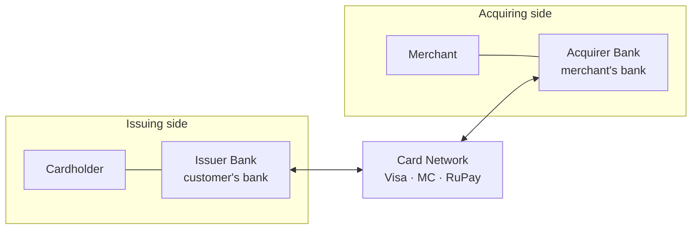
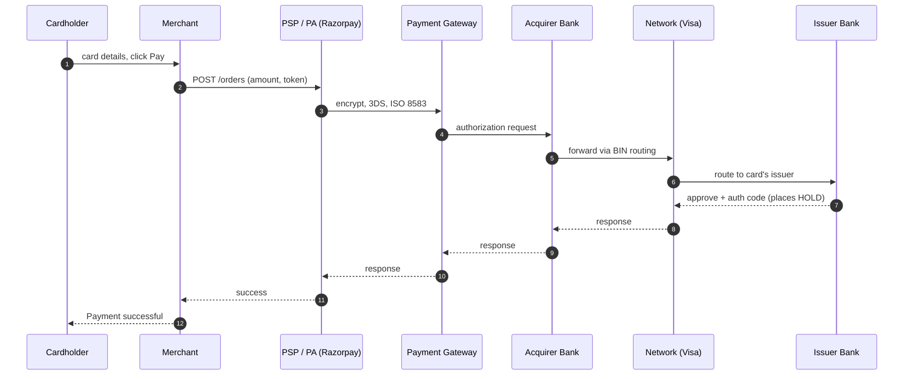
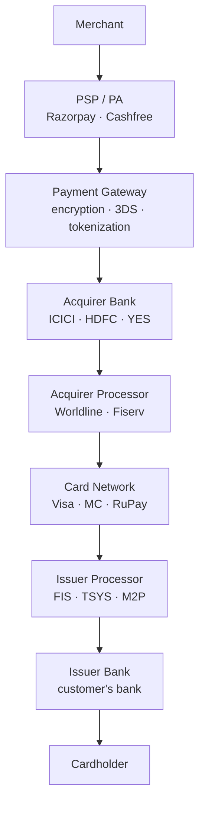
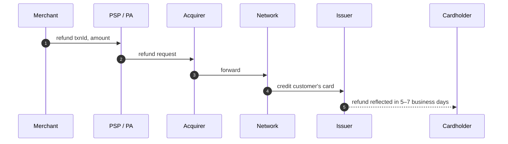

# actors.md — Payment Ecosystem Actors & Money Movement

> Phase -1 · Day 1 deliverable. Written by @Vaibhaw42 with Q&A guidance.
> Focus: India-first (UPI + cards + RBI). Global patterns second.

---

## 1 · Glossary

- **Issuer** — the bank that issued the customer's card (credit or debit). Holds the customer's funds (debit) or extends credit (credit card). Bears fraud/credit risk. Earns **interchange** on every transaction — biggest single slice of the MDR pie.
- **Acquirer** — the bank with an acquiring relationship to the merchant (directly, or via a PA like Razorpay). Receives settled funds from the card network on the merchant's behalf. Earns a slice of MDR. Bears chargeback + merchant risk. In India: HDFC, ICICI, Axis, SBI are large acquirers.
- **Card Network (Visa / Mastercard / RuPay / Amex)** — the messaging switch + rulebook that routes transactions between issuers and acquirers and guarantees settlement between member banks. Publishes operating rules for chargebacks, disputes, and liability shifts. Earns a **scheme / assessment fee** (~0.10–0.15%) per transaction. **RuPay** is India's domestic scheme, operated by **NPCI**.
- **Payment Gateway (PG)** — pure tech middleware that encrypts, tokenizes, and routes card/UPI transactions between the merchant's checkout and the network/PA. **Cannot legally hold merchant funds** — that requires a PA license (RBI, 2020). Handles PCI-scope work: 3D Secure challenge, tokenization, hosted checkout. Revenue = per-txn processing fee.
- **Payment Aggregator (PA)** — a licensed non-bank entity that pools payment flows from many merchants under a single acquiring relationship, so small merchants can accept cards without signing directly with a bank. Merchant funds sit in the PA's **nodal / escrow account** at its **sponsor bank** for up to T+1 (or per contract) before payout. Requires an RBI PA license (mandated by RBI's March 2020 PA/PG guidelines). Revenue = markup on MDR (charges merchant more than its acquiring cost, keeps the spread). Examples: Razorpay, Cashfree, PayU, CCAvenue.
- **PSP (Payment Service Provider)** — umbrella term for any company providing payment services to merchants (may be a PG, a PA, or both). Stripe, Adyen, Razorpay are all PSPs. In the **UPI context** specifically, "PSP Bank" is a scheduled commercial bank licensed by **NPCI** to run the UPI-PSP interface on behalf of a **TPAP** app — YES Bank for PhonePe, HDFC/Axis for GPay, Paytm Payments Bank (historically) for Paytm. A TPAP app cannot talk to NPCI directly; must route through its PSP Bank.
- **Processor** — a backend tech vendor that runs the actual switching, authorization, and settlement software *on behalf of* the issuing or acquiring bank. Not a hop in the merchant's visible flow — an invisible layer inside the bank. **Issuer processors** (FIS, TSYS, Fiserv, M2P, Zeta) run card management + auth for issuers. **Acquirer processors** (Worldline, Fiserv, First Data) run POS + settlement for acquirers. Banks pay per-transaction.
- **Nodal / Escrow account** — a segregated bank account at a scheduled commercial bank (the PA's sponsor bank) where a PA holds merchant funds **in trust** before payout. Legally ringfenced: the PA cannot commingle these funds with its own operating cash, use them as working capital, or earn interest on them. If the PA becomes insolvent, merchant funds are protected. RBI mandates strict reconciliation and audit. Pre-2020 term was "nodal"; RBI's 2020 PA guidelines switched to "escrow" to emphasize the trust nature — both terms used interchangeably today.
- **Sponsor bank** — a scheduled commercial bank that hosts a PA's nodal/escrow account and acts as the regulatory + operational bridge between the non-bank PA and the payment rails (networks, NPCI, RBI). Every PA must have one; a non-bank cannot connect directly to rails. Bears compliance responsibility for the PA's activity on its account. **Concentration risk:** if the sponsor bank hits trouble, PA operations stall — the YES Bank moratorium (March 2020) froze PA/TPAP flows briefly. Large PAs mitigate by diversifying across multiple sponsors. In UPI, the equivalent is the **PSP Bank** for a TPAP.
- **MDR (Merchant Discount Rate)** — the percentage fee a merchant pays on every card transaction to accept payment. Deducted from the transaction amount before payout, so the merchant receives `amount − MDR`. Split across **interchange** (issuer, biggest slice), **scheme/assessment fee** (network), **acquirer margin**, **PA/PSP markup**, plus **18% GST** on the fees. India card MDR ranges roughly 1.5–2.5% (RBI caps by card type; AMEX/Diners up to 3.5%). **UPI P2M MDR is 0%** (government mandate, Jan 2020); PSPs subsidize UPI via card MDR and adjacent revenue like BBPS, cross-sell, and ads. RuPay debit is also 0% MDR for small transactions.
- **TPAP (Third Party App Provider)** — a company approved by NPCI to build user-facing UPI apps. Provides the app UI, notifications, QR scanning, VPA registration. **Cannot hold funds. Cannot connect to NPCI directly** — must route through one or more **PSP Banks**. Examples: PhonePe, GPay, Paytm, CRED, Amazon Pay. Regulated under NPCI's UPI Procedural Guidelines.
- **VPA (Virtual Payment Address)** — a user-facing UPI identifier in the format `handle@psp-bank-code` (e.g. `vaibhaw@ybl`, `alice@okhdfcbank`, `bob@paytm`). The suffix identifies the **PSP Bank** that routes NPCI requests, **not the user's actual account bank**. Multiple VPAs can point to the same underlying bank account. Purpose: expose only a routing identifier while keeping the account number private. Common codes: `@ybl` (YES via PhonePe), `@okhdfcbank`/`@okaxis`/`@okicici` (via GPay), `@paytm` (Paytm), `@axl` (CRED via Axis).
- **NPCI (National Payments Corporation of India)** — a not-for-profit **operator** (not a regulator) promoted by RBI and the Indian Banks' Association. Operates India's retail payment systems: **UPI, IMPS, NACH, AePS, BHIM, RuPay, BBPS (Bharat BillPay), NETC (FASTag), CTS (cheque truncation)**. Publishes UPI procedural guidelines and approves TPAPs and PSP Banks. Owned by member banks.
- **RBI (Reserve Bank of India)** — India's central bank and financial regulator. Sets monetary policy, issues currency, licenses banks and non-bank entities (Payment Aggregators, NBFCs, PPIs, Payments Banks). Publishes rulebooks including the PA/PG Guidelines (2020), UPI-related regulations, and the data localization mandate (2018 — all Indian payment data must be stored on Indian soil). Regulator of NPCI. Does **not** operate payment systems itself.
- **Interchange** — the fee paid **by the acquirer to the issuer** on every card transaction. Set by the card network (Visa/MC/RuPay) via its interchange table. Compensates the issuer for extending credit, bearing fraud risk, and covering card-issuance cost — and incentivizes banks to issue more cards. **Biggest single slice of MDR** (~1–1.2% of a ~2% MDR). Regulated in some markets: EU capped at 0.2% (debit) / 0.3% (credit); India's RBI caps debit interchange by merchant category.
- **Assessment / Scheme fee** — the fee paid by the **acquirer to the card network** (Visa/MC/RuPay/Amex) on every transaction. Rate ≈ 0.10–0.15% of transaction value; sometimes split into a percentage-based **assessment fee** plus a flat per-transaction **authorization fee**. Compensates the network for running the switching infrastructure, licensing the brand, providing fraud tooling, and maintaining the rulebook. Second-largest slice of MDR after interchange.
- **Authorization (auth)** — the issuer's real-time approve-or-decline decision on a transaction request. Sent via the network from acquirer/PSP to issuer, who checks card validity, funds/credit availability, and fraud rules. On approval, the issuer places a **hold** on the customer's balance — available balance goes down, but the account is not actually debited yet. Holds auto-expire in 5–7 days if not captured.
- **Capture** — the merchant's explicit request to convert a previous authorization's hold into a real debit on the customer's account. Sent via the network to the issuer. Auth + capture in a single call is called a **"sale"** (default for most e-commerce). Delayed capture is used when the final amount isn't known at auth time — hotels (auth at check-in, capture at check-out), ride-hailing (auth ₹100 hold, capture actual fare), or ship-on-order flows. If capture doesn't happen within the auth's TTL, the hold expires and money returns to the customer.
- **Clearing** — the batch process (typically end-of-day) where the card network aggregates all captured transactions and calculates the **net amount owed between each pair of member banks**. Produces settlement instructions. **No money moves during clearing** — it is purely accounting and instruction generation.
- **Settlement** — the actual bank-to-bank movement of money based on clearing instructions. Executed via RTGS (or equivalent bank-to-bank rail) on **T+1** — one business day after the transaction. Money flows: issuer bank → network settlement account → acquirer bank → (via PA nodal, if applicable) → merchant's bank. **Settlement ≠ payout** — settlement is between banks; the PA-to-merchant payout is a separate later step.

---

## 2 · Cards ecosystem

### 2.1 · The four-corner model

Card payments are built on a **four-corner** architecture — four principal parties, everything else is glue.



- **Cardholder ↔ Issuer** — issuer gave the card; customer settles their bill with them.
- **Merchant ↔ Acquirer** — acquirer signed the merchant up to accept cards; pays out sales.
- **Issuer ↔ Acquirer** — they do not know each other's customers. The **network** is the switch that lets them talk.

### 2.2 · Two flows on the same rails — messages vs money

The single most important distinction in the whole domain.

**Message flow (real-time, sub-second to a few seconds):**



**Money flow (batch, T+1):**

```
Issuer bank
   └─► Network's settlement account
          └─► Acquirer bank
                 └─► PA nodal / escrow (Razorpay)
                        └─► Merchant's business bank
```

- Executes via RTGS / inter-bank rail on **T+1**.
- Merchant only sees funds after PA's payout step — usually T+1 or T+2 after txn date.
- **Bugs in fintech systems live at the boundary between message flow and money flow.**

### 2.3 · Where PSP/PA/PG sit — acquiring-side zoom

PA sits on the **acquiring side**, between merchant and acquirer bank.



**What PA hides from the merchant:**

1. Direct **acquirer contract** — PA holds it; merchant plugs into PA.
2. **Which network is used** (Visa vs MC vs RuPay — smart routing).
3. **Which processor** does the switching.
4. **PCI DSS scope** — PA holds PCI scope; merchant is out of scope. Huge cost saving.
5. **Network certifications** — Visa/MC/RuPay each require cert; PA does it once, all merchants inherit.
6. **Chargeback handling + reconciliation + settlement files + ISO 8583 wire format** — all PA problem.

Merchant's mental model: *"I pay Razorpay to accept payments."* Everything else is Razorpay's problem.

### 2.4 · Card network's role — routing vs clearing

Two hats depending on the flow:

| Flow | Network does |
|------|--------------|
| **Message (real-time)** | Pure switch. BIN-based routing to issuer. Enforces ISO 8583 protocol. Adds advisory fraud scoring (Visa Advanced Auth, MC SAFE). **Does NOT approve or deny** — that's the issuer's decision; network only relays it. |
| **Money (T+1 batch)** | **Clearing** — aggregates all captured transactions end-of-day, computes the net amount owed between every pair of member banks. Publishes settlement instructions. Runs a **settlement bank** through which inter-bank money movement is coordinated. |

Without the network, ICICI's POS could never reach HDFC's card, and banks would have no shared source of truth on who owes whom.

### 2.5 · Refund / reverse flow

A refund is a **new transaction** on the same rails, in the opposite direction.



- Refund has its own auth flow (issuer approves the credit-back).
- Money returns via same T+1 rails, reversed direction.
- **Original MDR usually not refunded to merchant** — merchant eats the fee.
- Customer sees refund on statement in **5–7 business days** due to issuer processing.

### 2.6 · ISO 8583 — the wire format

All card message flow globally speaks **ISO 8583**, a fixed protocol with 128 numbered fields (PAN, amount, MCC, timestamp, etc.). Standardized in 1987 and still ubiquitous. Every issuer, network, and processor speaks it under the hood. Modern APIs (Stripe, Razorpay) wrap ISO 8583 in JSON so an application developer never sees it — but it is the low-level truth of the card wire.


---

## 3 · UPI ecosystem

_(pending)_

---

## 4 · Money-flow trace — ₹1000 card txn end-to-end

_(pending)_

---

## 5 · Fee breakdown

_(pending)_

---

## 6 · India-specific notes (RBI, NPCI, PA/PG, UPI)

_(pending)_

---

## 7 · What I still don't understand

_(pending)_
