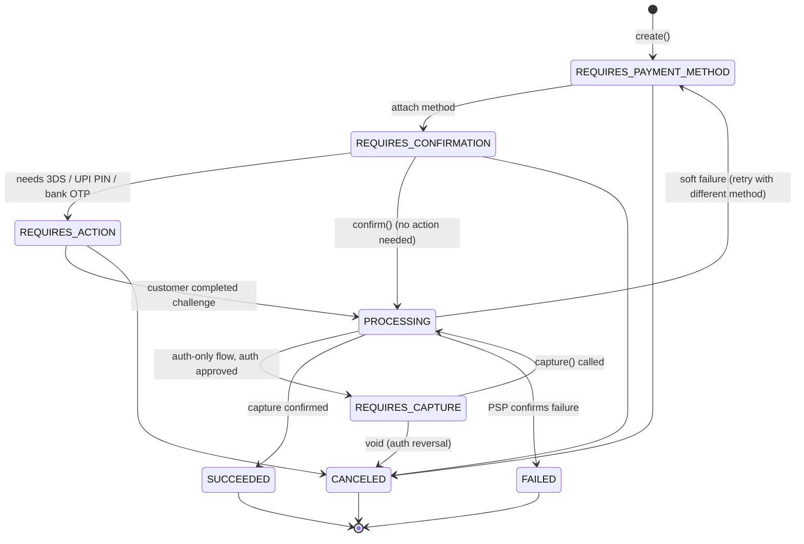
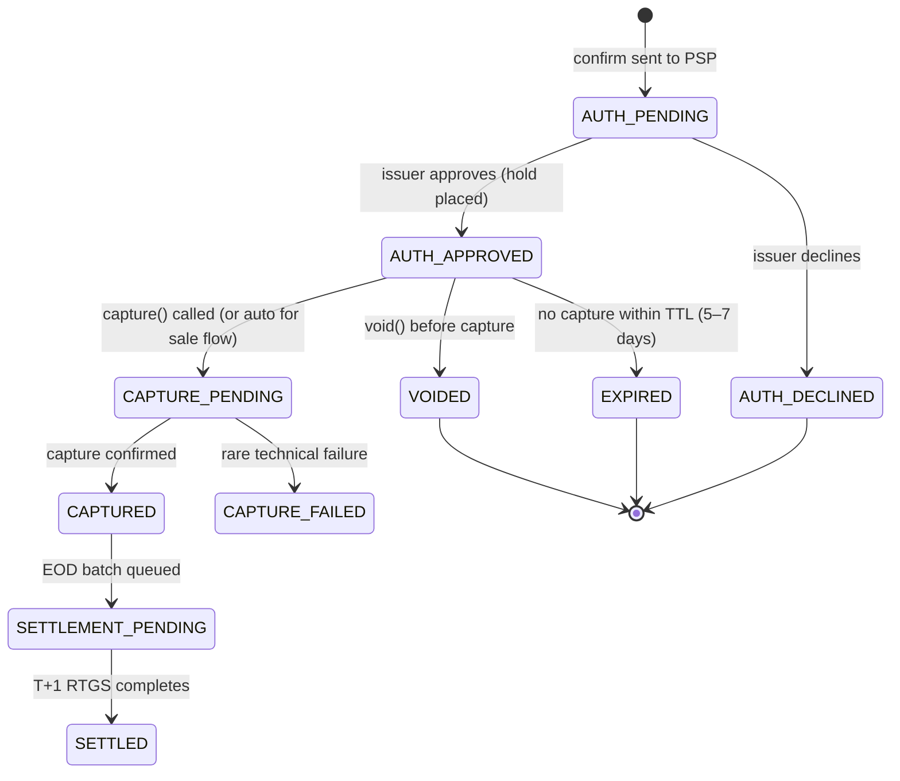
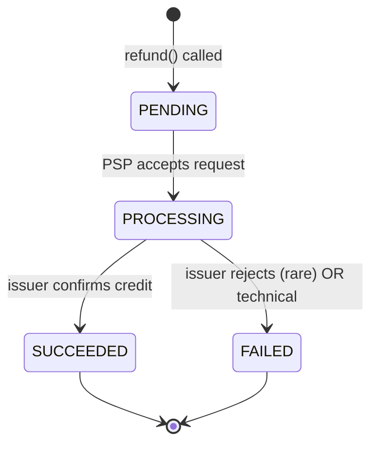

# txn-lifecycle.md — Transaction Lifecycle & State Machines

> Phase -1 · Day 3 deliverable. Direct input to Phase 4 (Payment Engine) design.

State machines govern **every** money-moving system. This doc locks the states, transitions, retries, and idempotency contracts that PayForge will implement.

---

## 1 · Why state machines matter in payments

### 1.1 · Booleans cannot represent a payment

A naïve `is_paid: boolean` cannot express a real transaction because:

1. **Cardinality** — real txns move through 10+ states (pending, requires_action, authorized, captured, refunded, disputed, ...). A 2-value type physically cannot express this.
2. **Temporal state** — is it "in progress" (retry-able) or "definitively failed" (do not retry)? A boolean cannot distinguish these; retry loops hit PSP forever on a state that never resolves.
3. **Post-success events** — chargebacks and disputes arrive **weeks after** a success. Flipping `is_paid` back to `false` destroys audit history.
4. **Terminality** — some states allow further transitions, some don't. A boolean has no notion of terminality.

The `if/else` soup you'd need to compensate for a boolean is the *symptom* of the missing state machine.

### 1.2 · A state machine gives you

- **States** — the possible situations a txn can be in.
- **Transitions** — what triggers a move from state A to state B.
- **Terminal states** — end-of-life states (SUCCESS, FAILED, EXPIRED, REFUNDED, CHARGED_BACK) from which no further outbound transitions exist.
- **Invariants** — rules that must always hold, e.g. "an authorized txn without a capture within TTL becomes EXPIRED, not SUCCESS".

### 1.3 · The single most important rule

> **State transitions are one-way. Money is never un-moved. It's compensated with a new transaction.**

Once `SUCCESS` is recorded, the row is immutable. To reverse effects, you:

- **Issue a refund** — a **new txn row** with `original_payment_id` foreign key, its own state machine, and (in the ledger) a compensating DR/CR pair.
- **Handle a chargeback** — **yet another new row** — different state machine, initiated by customer via issuer, different fees. Never confused with a refund.

This is why fintech ledgers are **append-only, immutable**. You do not UPDATE rows; you INSERT compensating rows.

### 1.4 · Persist state, do not compute it

Anti-pattern: derive txn status by calling `psp.getStatus(txnId)` on every read.

Problems:

- **Outage fragility** — PSP down → your entire read path (dashboards, receipts, order status) breaks.
- **Rate limits + cost** — real PSPs enforce per-second and per-day API caps; some charge per status call. On-every-read burns quota fast.
- **Race conditions** — concurrent readers get slightly different snapshots → your code branches on different values within the same request.
- **Compliance / audit** — you can only audit what you stored. On-the-fly reads leave no historical trace of "what was the state at 14:32 yesterday?".
- **Latency SLO** — every read adds a hop to PSP; your P99 becomes PSP's P99 + your own.

**Correct pattern (locks Phase 4 design):**

1. Persist state in your DB, updated by events (webhook, poll, reconciliation batch).
2. Serve reads **only from your DB** — never block on PSP.
3. Reconcile with PSP end-of-day to catch drift.
4. **PSP is the source of truth for the wire; your DB is the source of truth for your system.** Different scopes.

### 1.5 · Every state change is an event

A state-change that only lives in a process variable is not real. In PayForge, every transition:

- Writes to the append-only event log (audit trail)
- Emits to Kafka (Phase 5+ — enables ledger, webhook, fraud, analytics)
- Triggers a webhook to the merchant (Phase 7)
- Increments a metric for observability (Phase 10)
- Updates the persisted state row via a single atomic transaction

If your process crashes, the DB state + Kafka event log are the source of truth. Restart, resume.


---

## 2 · Unified payment intent state model

### 2.1 · The 8 states — industry standard

Stripe's PaymentIntent vocabulary became the de-facto standard; Razorpay, Adyen, Cashfree all use variants. PayForge follows.



| State | Meaning | Terminal? |
|-------|---------|-----------|
| `REQUIRES_PAYMENT_METHOD` | Intent created; awaiting method attach (card token, VPA, etc.) | No |
| `REQUIRES_CONFIRMATION` | Method attached; awaiting merchant confirm | No |
| `REQUIRES_ACTION` | **Ball is in customer's court** — 3DS OTP, UPI PIN screen, netbanking OTP | No |
| `PROCESSING` | Confirmed; PSP working the wire (auth/capture in flight) | No |
| `REQUIRES_CAPTURE` | Auth-only flow: auth approved (hold placed); waiting for merchant `capture()` | No |
| `SUCCEEDED` | Money confirmed captured | **Yes** |
| `FAILED` | Auth declined / final failure | **Yes** |
| `CANCELED` | Merchant / customer aborted before capture (includes auth reversal / void) | **Yes** |

Memory hooks:
- **REQUIRES_ACTION = customer's turn.** PROCESSING / REQUIRES_CAPTURE = system's / merchant's turn.
- **REQUIRES_CAPTURE only exists for auth-only (delayed-capture) flows** — e-commerce sale flow skips it entirely and goes PROCESSING → SUCCEEDED directly.

### 2.2 · Merchant contract vs internal state

The 7 states are the **external merchant contract**. Internally PayForge may track finer sub-states inside `PROCESSING` (`auth_pending`, `captured_pending`, `settlement_batched`, etc.) — merchants do not care and must not see them.

**Design rule:** the externally exposed state contract is small + stable. Internal state can be richer. Never leak internal states in APIs.

### 2.3 · Cancel semantics

`cancel()` is legal in **pre-flight** and **auth-only-before-capture** states:

- `REQUIRES_PAYMENT_METHOD`, `REQUIRES_CONFIRMATION`, `REQUIRES_ACTION` → cancel succeeds (nothing sent to wire yet)
- `REQUIRES_CAPTURE` → cancel triggers **auth reversal / void** — hold is released; state moves to CANCELED
- `PROCESSING`, `SUCCEEDED`, `FAILED`, `CANCELED` → cancel fails

Why the cutoff at `PROCESSING`? Once auth is fired to PSP → forwarded to network → issuer, the message is in flight across banks; there is no cancel button on the wire. Only remedy after PROCESSING is: wait for terminal state, then refund if it SUCCEEDED.

Real-world quirk (know it exists): some PSPs support **authorization reversal / void** during PROCESSING if capture hasn't happened yet. That is a PSP-specific concept, not merchant cancel. In our unified model, PROCESSING is post-flight → no cancel.

Guard in Phase 4:

```ts
if (state !== 'REQUIRES_PAYMENT_METHOD'
 && state !== 'REQUIRES_CONFIRMATION'
 && state !== 'REQUIRES_ACTION') {
  throw new PaymentIntentNotCancellable(state)
}
```

### 2.4 · One model, N payment methods

The unified 7-state model applies across cards, UPI, netbanking, wallets, EMI, BNPL. What differs is **which sub-states inside PROCESSING** get exercised — the merchant contract stays identical.

This is what lets PayForge expose **one clean API** to merchants regardless of underlying method. Merchant switches cards → UPI → same state names, same transition events.

### 2.5 · Payment intent ≠ order ≠ ledger entry

Three distinct concepts, easily confused:

| Concept | Owned by | Lives in |
|---------|---------|----------|
| **Order** | Merchant's business logic | `orders` — merchant's system |
| **Payment Intent** | PayForge's payment engine | `payment_intents` — our system |
| **Ledger Entry** | Double-entry ledger | `journal_entries` + `postings` — Phase 5 |

**Relationships:**

- 1 order : N payment intents (retries, split payments, second attempt after decline)
- 1 payment intent : N ledger entries (payment posting + fee posting + subvention posting + later refund posting …)
- Order state machine (`PENDING → CONFIRMED → PACKED → SHIPPED → DELIVERED`) is the merchant's problem, not ours.

**Rule:** orders own themselves; payment intents own themselves; link via foreign key. Merchant maps `payment_intent.state = SUCCEEDED → order.status = CONFIRMED` via **their** business rule — never ours.

PayForge stores only:

```sql
payment_intents
  id
  merchant_id
  order_ref            -- merchant's opaque order id
  amount_minor         -- integer minor units (paise)
  currency             -- 'INR'
  method               -- 'card' | 'upi' | 'netbanking' | ...
  state                -- one of the 7
  created_at, updated_at
```

We never touch `orders`. Merchant's problem.


---

## 3 · Card txn state transitions

### 3.1 · Card sub-states inside PROCESSING

External state (merchant-facing) is one of the 8. Internal card sub-states inside PROCESSING are finer:



Mapping internal → external:

| Internal | External |
|----------|----------|
| AUTH_PENDING | PROCESSING |
| AUTH_APPROVED (auth-only) | REQUIRES_CAPTURE |
| AUTH_APPROVED → CAPTURE_PENDING (sale flow) | PROCESSING |
| CAPTURED, SETTLEMENT_PENDING, SETTLED | SUCCEEDED |
| AUTH_DECLINED, CAPTURE_FAILED | FAILED |
| VOIDED, EXPIRED | CANCELED |

### 3.2 · Sale vs Auth-only vs Delayed capture

**Sale (auth + capture in one call)** — the e-commerce default. Merchant sends `charge()`; PSP does auth then capture immediately. Intent transitions `PROCESSING → SUCCEEDED` in one round-trip.

**Auth-only (delayed capture)** — merchant calls `authorize()` → issuer holds funds → intent `REQUIRES_CAPTURE`. Later merchant calls `capture()` → intent `PROCESSING → SUCCEEDED`.

Where auth-only is used:

- **Hotels** — auth at check-in, capture at check-out.
- **Ride-hailing (Uber)** — auth ₹100 hold, capture actual fare.
- **Marketplaces** — auth on order, capture on ship.
- **Petrol pumps** — auth ₹1 validity check, capture actual fuel.

Capture window is 5–7 days for retail, up to 30 days for travel & entertainment. After the window, uncaptured auth **auto-expires** — the hold drops off the customer's card.

**Partial capture** — merchant can capture LESS than authorized (auth ₹5000, capture ₹3200). Remaining hold drops after window or explicit void.

**Multi-capture** (rare) — capture in chunks summing ≤ authorized. Complex; PayForge won't support day-one.

### 3.3 · Void vs Refund — timing decides which

| Action | When legal | On the wire | Customer sees |
|--------|-----------|-------------|---------------|
| **Void (auth reversal)** | After AUTH_APPROVED, **before capture** | Auth reversal message; hold released | Hold drops off card in minutes to hours |
| **Refund** | After CAPTURED | New refund txn, opposite direction, T+N | Refund credited in 5–7 business days |

**Always prefer void if capture hasn't happened.** Void is fast + free; refund is slow + costs rails fees (and merchant often loses MDR on refund).

**Rule:**
- Cancel before shipping, capture not done → **void**
- Cancel after shipping, capture done → **refund**

### 3.4 · Auth expiration

Auths that are approved but never captured within TTL auto-expire:

- Retail: 5–7 days.
- Travel & entertainment (T&E MCC): up to 30 days.
- Issuer drops the hold automatically; customer's available balance restored.

**Design constraint for PayForge:** every AUTH_APPROVED needs an `expires_at` timestamp and a scheduled reconciliation job flipping expired auths to terminal state.

### 3.5 · Decline codes → state transitions

Different decline codes = different downstream behavior:

| Code | Meaning | State | Merchant action |
|-----:|---------|-------|-----------------|
| 51 | Insufficient funds | FAILED (hard) | Don't retry same card |
| 05 | Do not honor (opaque, most common) | FAILED (hard) | Don't retry; suggest other method |
| 14 | Invalid card | FAILED (hard) | Typo? |
| 54 | Expired card | FAILED (hard) | Update details |
| 41 / 43 | Lost / stolen | FAILED (hard) + block | Never retry; alert customer |
| 61 | Exceeds per-txn amount limit | FAILED (hard) | Suggest lower amount |
| 65 | Daily activity count exceeded | FAILED (hard, retry tomorrow) | Wait & retry next day |
| 91 | Issuer unavailable | FAILED (soft, retryable) | Smart-route to different acquirer/scheme |
| 96 | System malfunction (network/PSP) | FAILED (soft, retryable) | Exp backoff retry |

**Two flavors of FAILED:**

- **Hard failure** — do not retry with same card. Show customer, offer alternate method.
- **Soft failure** — retryable. PA smart-routes across acquirers, or exp-backoff for transient issues.

**Retry nuance:** for code 91 (issuer down), same-route retry likely fails — use **smart routing** (different scheme/acquirer). For code 96 (transient glitch), exp backoff on same route is fine. **Don't blanket-retry on any FAILED.**

**Persistence contract for PayForge Phase 4:**

```ts
{
  status: 'FAILED',
  reason_code: '91',
  reason: 'issuer_unavailable',
  is_retryable: true,
  suggested_action: 'route_alternative_scheme'  // or 'exponential_backoff' or 'no_retry'
}
```

### 3.6 · 3DS state transitions

3DS happens inside the confirm → PROCESSING transition:

```
confirm() → PROCESSING → 3DS challenge → REQUIRES_ACTION (customer sees OTP)
REQUIRES_ACTION → customer types OTP → 3DS validated → PROCESSING (resume)
PROCESSING → issuer auth → AUTH_APPROVED / AUTH_DECLINED
```

**3DS 2.0 frictionless flow** — issuer's risk engine trusts device+behavior → no OTP shown → skips REQUIRES_ACTION entirely, stays in PROCESSING throughout. Still counts as 3DS-authenticated (liability shift still applies).

**Customer abandonment** — customer stalls on OTP screen for 5 min then closes tab → timeout → FAILED with `reason=3ds_timeout`.

### 3.7 · Full card txn timeline (real world, e-commerce sale)

```
T=0s      : confirm() → PROCESSING
T=0.1s    : PSP → PG → acquirer → network → issuer
T=1s      : issuer responds "approved, OTP required" → REQUIRES_ACTION
T=1.5s    : customer sees OTP screen
T=30s     : customer types OTP → REQUIRES_ACTION → PROCESSING
T=32s     : issuer confirms auth → AUTH_APPROVED (external still PROCESSING)
T=32s     : PSP auto-fires capture (sale) → CAPTURE_PENDING
T=33s     : capture confirmed → CAPTURED → SUCCEEDED (external)
--- merchant sees "success" ---
T=EOD     : clearing batch → SETTLEMENT_PENDING (external still SUCCEEDED)
T+1 day   : RTGS bank-to-bank → SETTLED
T+2 day   : PA payout to merchant bank → merchant has usable money
```

Merchant sees ONE external transition (PROCESSING → SUCCEEDED). Internally 6+ sub-states passed. The whole clearing/settlement/payout tail happens **after** merchant already thinks it succeeded.

### 3.8 · Refund state transitions

Refund is a **new state machine** on a separate `refund` object — it does NOT modify the payment intent's terminal state.



- **Partial refunds** — sum of refund amounts ≤ captured amount. Multiple partial refunds allowed against one payment intent.
- **Payment intent stays SUCCEEDED forever.** Compensating rows accumulate in the `refunds` table.
- Refund settlement takes ~5–7 business days visible to customer (issuer processing).


---

## 4 · UPI txn state transitions

_(pending)_

---

## 5 · Refund lifecycle

_(pending)_

---

## 6 · Chargeback + dispute lifecycle

_(pending)_

---

## 7 · Idempotency contracts

_(pending)_

---

## 8 · Retry semantics + timeouts

_(pending)_

---

## 9 · Reconciliation states

_(pending)_

---

## 10 · Anti-patterns (what NOT to do)

_(pending)_

---

## 11 · What I still don't understand

_(to fill)_
